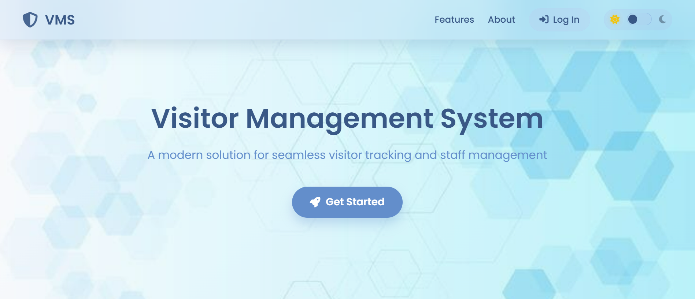
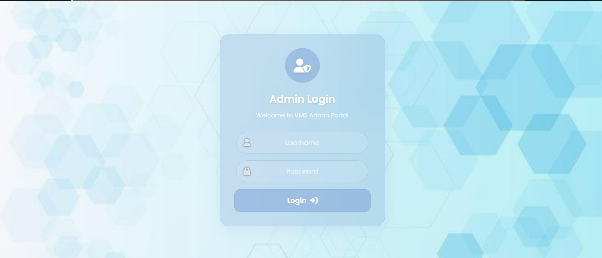
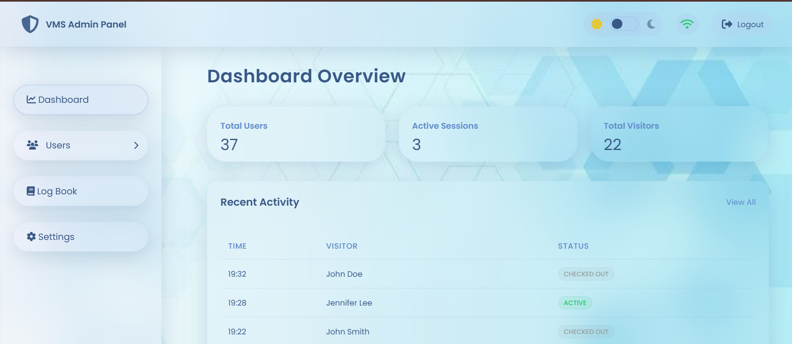
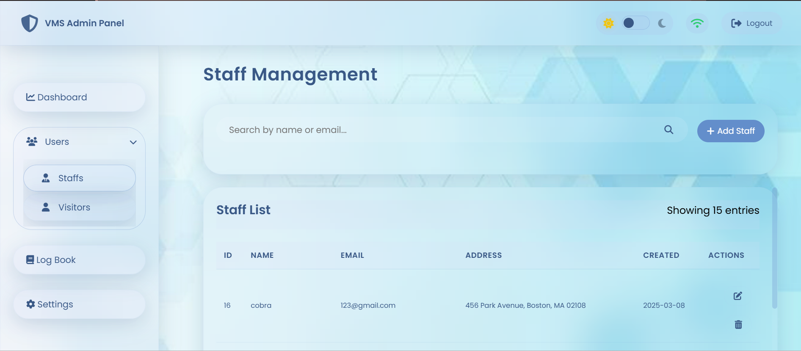
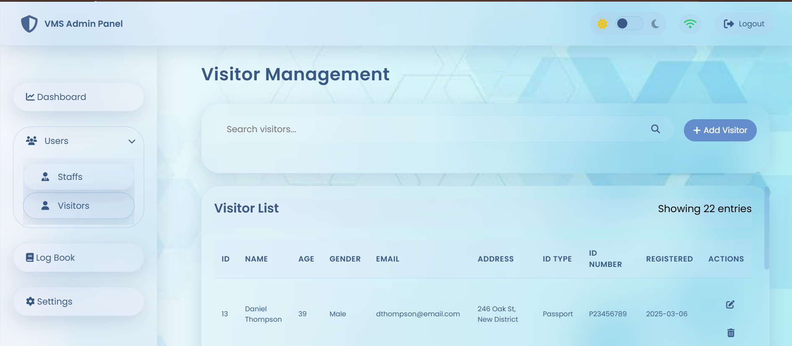
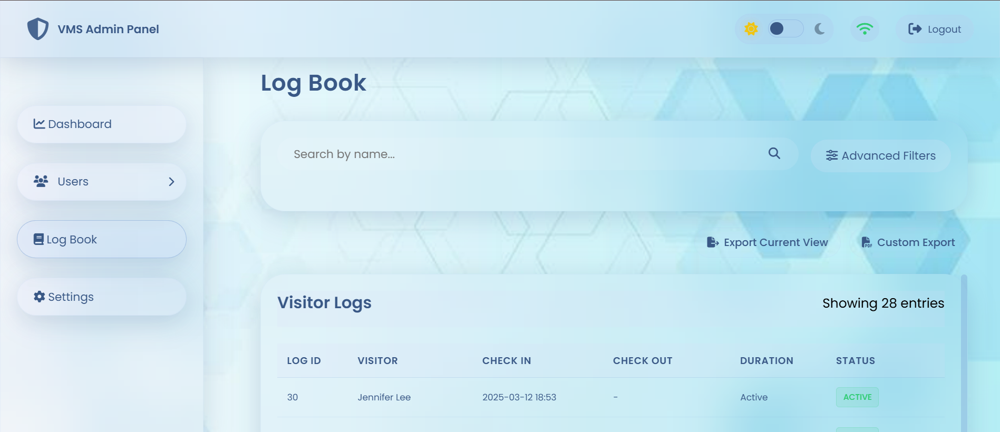
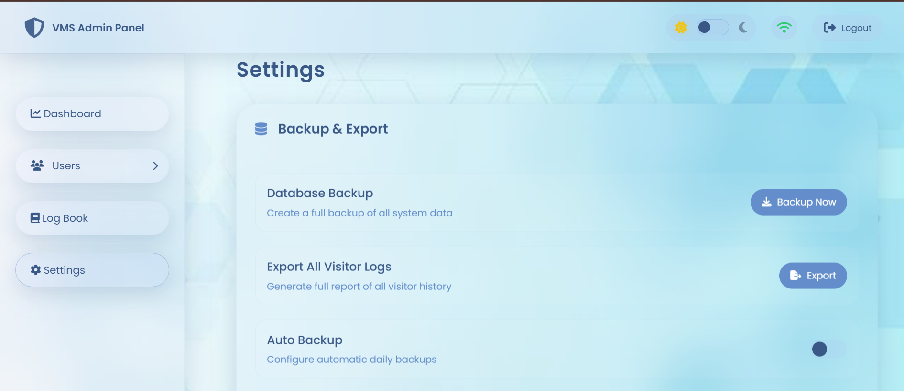
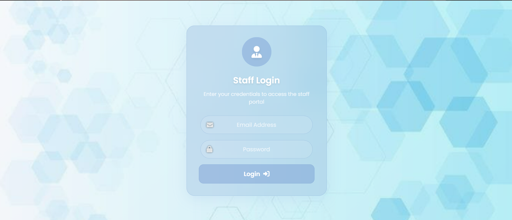
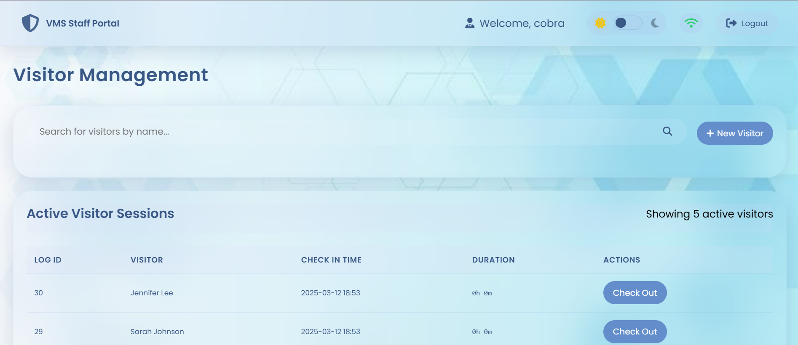
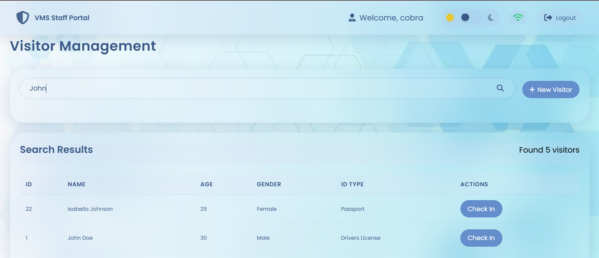

# Visitor Management System

A modern solution for seamless visitor tracking and staff management built with Flask and modern web technologies.

## Features

- **Visitor Management**
  - Search, register, check-in and check-out visitors with ID verification and tracking
  - Comprehensive visitor logs with advanced search capabilities

- **Multi-Level Access Control**
  - Staff portal for day-to-day operations
  - Admin dashboard for system management and configuration

- **Digital Log Book**
  - Comprehensive visitor logs with search, filtering and advanced export options
  - Export logs to PDF and Excel with customizable fields

- **User Experience**
  - Beautiful glassmorphic UI with responsive design
  - Light and dark theme support with toggle functionality
  - Real-time status indicators and notifications

- **Data Management**
  - Complete database backup and restore functionality
  - Automated backup scheduling options
  - Data export in multiple formats

## Screenshots

### HomePage

*Homepage*

### Admin Login

*Admin Login Page*

### Admin Dashboard

*Admin dashboard with real-time visitor statistics and activity monitoring*

### Staff Management

*Staff Management Page*

### Visitor Management

*Visitor Management Page*

### Digital Log Book

*Comprehensive visitor logs with advanced filtering options*

### Settings Panel

*System configuration and backup management*

### Staff Login

*Staff Login Page*

### Staff Portal

*Staff interface for visitor registration and management*

### Visitor Check-in

*Streamlined check-in process with ID verification*

## Technology Stack

- Python with Flask backend
- MySQL database
- HTML5, CSS3, JavaScript frontend
- Font Awesome icons
- Responsive design for all devices

## Installation

1. Clone the repository:
   ```bash
   git clone https://github.com/FALLEN-01/Visitor-Management.git
   cd Visitor-Management
   ```

2. Create and activate a virtual environment:
   ```bash
   python -m venv venv
   source venv/bin/activate  # On Windows: venv\Scripts\activate
   ```

3. Install dependencies:
   ```bash
   pip install -r requirements.txt
   ```

4. Configure the database settings in `app.py`

5. Run the application:
   ```bash
   python app.py
   ```

6. Access the application at `http://localhost:5000`

## Usage

### Home Page
- Overview of the system features
- Links to staff and admin login pages

### Staff Access
- Use staff credentials to log in at `/staff_login`
- Register and manage visitors
- View current visitor status

### Admin Access
- Navigate to `/admin_login` for admin access
- Configure system settings
- Manage users and permissions
- View comprehensive logs and reports
- Perform backup and restore operations

## File Structure

- `app.py`: Main application entry point
- `static`: CSS, JavaScript, and images
  - `admin.css`, `admin_login.css`: Admin interface styles
  - `static/home.css`: Landing page styles
  - `static/settings.js`: Settings page functionality
  - `favicon/`: Application icons
- `templates`: HTML templates
  - Admin and staff interfaces
  - Visitor management screens
  - Settings and configuration pages


## Detailed Instructions

### First-Time Setup

1. After installation, access the admin panel at `/admin_login`
2. Default credentials:
   - Username: ``
   - Password: ``
3. Change the default password immediately
4. Configure system settings before adding users

### Adding Staff Users

1. In the admin panel, navigate to "User Management"
2. Click "Add New User"
3. Fill in required details and assign appropriate permissions
4. New staff can log in at `/staff_login` with their credentials

### Visitor Registration Process

1. Staff logs into portal
2. Select "Register Visitor" from the dashboard
3. Enter visitor details including:
   - Name
   - Contact information
   - Purpose of visit
   - ID verification (optional photo capture)
4. Submit the form to register visitor
5. System generates a visitor badge that can be printed

### Reports and Exports

1. Access "Reports" section in admin panel
2. Select date range and filter options
3. Generate report and export in desired format (PDF/Excel)
4. Automated reports can be scheduled in Settings

## Version

Current version: 2.6.3

## License

© 2025 JEFFIN BASIL. All rights reserved.
See `LICENSE` file for details.
